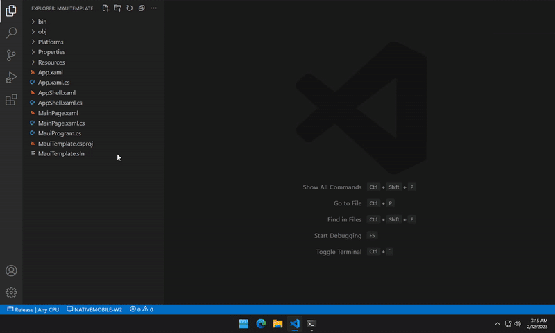

## .NET Meteor
This VSCode extension allows you to build, debug .NET 6 / .NET 7 apps and deploy them to devices or emulators. The following table lists supported .NET MAUI target platforms and their capabilities:

| Application Type | Build and Run (including Emulators) | Debugging |
|-|-|-|
| WinUI | ✅ | ❌ |
| Android | ✅ | ✅ |
| iOS | ✅ | ✅ |
| MacCatalyst | ✅ | ✅ |
| MAUI Blazor | ✅ | ✅ |

# Included Features

* Fast and responsive.
* Do not require to install the OmniSharp VSCode Extension.
* Shows all projects that exist in the opened workspace.
* Works on Windows, MacOS, and Linux (tested on Ubuntu).

# Run the Application

1. Open a project's folder.
2. Open the Run and Debug VSCode tab and click the `create a launch.json file`.
3. In the opened panel, select the `.NET Meteor Debugger`.
4. In the status bar, select a project (if your opened folder contains several projects) and a configuration (the debug is the default).
5. In the status bar, click the device name and select a target device/emulator from the opened panel.
6. Press F5 to launch the application in the selected configuration (debug, release, etc.). 
7. Enjoy!

# Limitations

* The application's Hot Reload is not available. We are working on implementing this feature.

# More Topics

* [Getting Started for MAUI Development with DotNet.Meteor Extension](https://github.com/JaneySprings/DotNet.Meteor/wiki/Getting-started-for-MAUI-development-with-DotNet.Meteor-extension)
* [Customize Predefined Tasks](https://github.com/JaneySprings/DotNet.Meteor/wiki/Predefined-task-customization)
